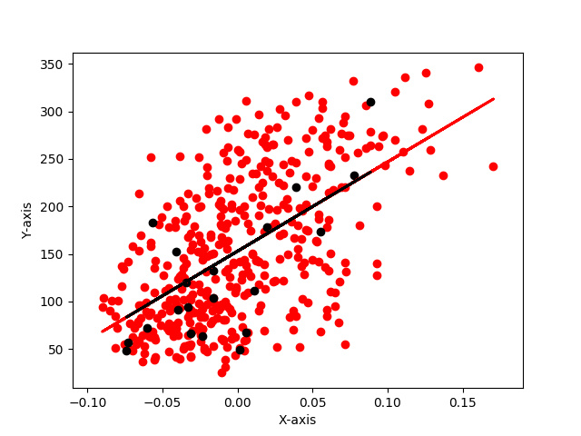

# Machine Learning Python Implementation

A simple python implementation of basic Machine Learning models using Scikit-Learn and Tensorflow



## Getting Started

These instructions will get you a copy of the project up and running on your local machine for development and testing purposes.

### Prerequisites


* [Numpy](http://www.numpy.org/) - Multidimensioanl Mathematical Computing 
* [Sciki-Learn](http://scikit-learn.org/stable/install.html) - Machine Learning Models
* [Matplotlib](https://matplotlib.org/contents.html) - Used to plot Graph
* [Pickle](https://docs.python.org/3/library/pickle.html) - Used to save trained models/object
* [Pandas](http://pandas.pydata.org/pandas-docs/version/0.18.0/) - Used to load dataset
* [Tensorflow](https://www.tensorflow.org/install/) - Used in Deep Neural Network to create models
* [Quandl](https://anaconda.org/anaconda/quandl) - Financial and economic datasets from hundreds of publishers directly into Python


### Installing

Clone the repository

```
git clone https://github.com/zishansami102/Machine-Learning-Python
```
Move into the required directory and then run the following command to start training model

```
python filename
```

## Contributing

Contributions are welcome of course ;)


